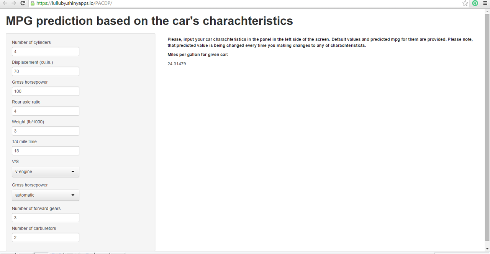

## Data

Here there is a mtcars dataset, containing 11 variables, using which we want to build the prediction model predicting mpg based on all other variables


```r
data(mtcars)
```


## Prediction model

Here is how we build the model and how to get the prediction mpg value for car charachterictic vales in R

```r
mc <- randomForest(mpg ~ ., data = mtcars, importance=TRUE)
predict(mc, data.frame(cyl=6, wt=2.62, disp=160, hp=110, drat=3.9,
     qsec=16.46, vs=0, am=1, gear=4, carb=4))
```

```
##        1 
## 20.72181
```

---


## Server application code


Here is a server code using the same model to predict mpg based on values input by user

```r
shinyServer(function(input, output) {
        res <- reactive({mc <- randomForest(mpg ~ ., data = mtcars, importance=TRUE); 
                         predict(mc, data.frame(cyl=as.numeric(input$cyl), wt=as.numeric(input$wt), 
                             disp=as.numeric(input$disp), hp=as.numeric(input$hp),
                             drat=as.numeric(input$drat), qsec=as.numeric(input$qsec),
                             vs=as.numeric(input$vs), am=as.numeric(input$am),
                             gear=as.numeric(input$gear), carb=as.numeric(input$carb)))})
        output$result <- renderText({res() })     })
```

---

## Client code
Here is client code describing UI part of the app and passing input values to server function and displaying the result to user

```r
shinyUI(pageWithSidebar(headerPanel("MPG prediction based on the car's charachteristics"),
    sidebarPanel(numericInput("cyl", "Number of cylinders", 4, min=1, max=32, step=1),
        numericInput("disp", "Displacement (cu.in.)", 70, min=1, step=0.1),
        numericInput("hp", "Gross horsepower", 100, min=10, step=1),
        numericInput("drat", "Rear axle ratio", 4, min=1, max=10, step=0.01),
        numericInput("wt", "Weight (lb/1000)", 3, min=1, max=10, step=0.001),
        numericInput("qsec", "1/4 mile time", 15, min=10, max=50, step=0.01),
        selectInput("vs", "V/S", choices = list("v-engine" = "0", "s-engine" = "1")),
        selectInput("am", "Gross horsepower", choices = list("automatic" = "0", "manual" = "1")),
        numericInput("gear", "Number of forward gears", 3, min=1, max = 10, step=1),
        numericInput("carb", "Number of carburetors", 2, min=1, max=10, step=1)
    ),
    mainPanel(h5("Please, input your car charachteristics in the panel in the left side of the screen. Default values and predicted mpg for them are provided. Please note, that predicted value is being changed every time you making changes to any of charachteristicts."),
        h5("Miles per gallon for given car:"),
        textOutput('result'))))
```

--- .class #id 

## App user interface




